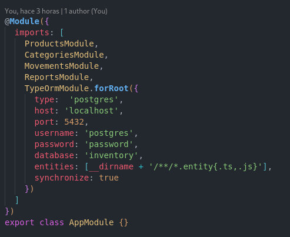

**Autor:** Junior Castillo  
**Contacto:** [castillojunior099@gmail.com](mailto:tu_email@ejemplo.com)

# Backend para Sistema de Inventario

## Descripción del Proyecto

Este proyecto es un backend diseñado para gestionar un sistema de inventario de productos. Implementa operaciones CRUD (Crear, Leer, Actualizar, Eliminar) para productos, categorías y movimientos (entradas y salidas), utilizando NestJS como framework de desarrollo y PostgreSQL como base de datos.

## Funcionalidades Principales

- Gestión de productos (CRUD).
- Gestión de categorías de productos (CRUD).
- CRUD para registro y seguimiento de movimientos de inventario (entradas y salidas).
- Generación de reportes sobre los movimientos realizados en el inventario.

## Descripción de Componentes

app.module.ts: Módulo principal que configura el proyecto, importando otros módulos y configurando la base de datos.
Modules: Cada módulo (productos, categorías, movimientos, report) contiene su propio controlador, servicio y entidad, organizando la lógica y los datos de manera clara y mantenible.
Entities: Clases que representan la estructura de los datos en la base de datos, garantizando la integridad de los datos.
DTO (Data Transfer Object): Clases que definen la estructura de los datos enviados y recibidos en las peticiones, facilitando la validación y transformación de los datos.
Requisitos Previos

## Para ejecutar este proyecto, se debe cumplir con los siguientes requisitos:

- Instalar PostgreSQL
- Instalar Node.js
- Instalar dependencias: Abrir la terminal o símbolo del sistema y navegar al directorio del proyecto, luego ejecutar: `npm install`

## Creación de la Base de Datos

Antes de ejecutar el proyecto, se debe crear la base de datos:

- Abrir la terminal o símbolo del sistema y acceder a la consola de PostgreSQL con el comando: `psql -h localhost -U postgres -d postgres`
- Crear la base de datos para el sistema de inventario: `CREATE DATABASE inventory;`
- En el archivo 'app.module.ts', se deben poner las credenciales de su usuario y contraseña de PostgreSQL. En mi caso, se ve algo así:

  

## Ejecución del Proyecto

Con los requisitos previos completados, se procede a ejecutar el proyecto:

- Iniciar el servidor: En la terminal, se debe ejecutar el siguiente comando para iniciar el servidor: `npm run start`. Esto iniciará el servidor y creará automáticamente las tablas en la base de datos.
- En la consola de PostgreSQL, se debe ejecutar el siguiente comando para cambiarse a la base de datos 'inventory': `\c inventory`
- Insertar datos iniciales: Ejecuta el archivo script.sql, que se encuentra en la raíz del proyecto, para realizar las inserciones correspondientes en las tablas de la base de datos. Podrá hacerlo desde la consola de PostgreSQL: `\i /ruta/a/tu/proyecto/script.sql`

NOTA: Para generar el reporte, siga la siguien estructura en la petición (reemplace las fechas por de ejemplo por la fecha actual del día):
`http://localhost:3000/reports?startDate=2024-10-14&endDate=2024-10-15`
